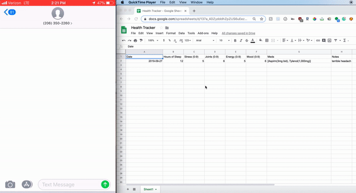

# HealthTracker

Light-weight app to track your symptoms and medications in Google Sheets using sms.

Text a designated number symptoms and medication changes daily (or however often you want) and save results in a Google Sheet. Get intermittent reminders to text number.

## Prerequisites
* Python 3.7
* Twilio Account
* Google Developer Account
* Heroku Account or other hosting service account

## Installing
1. Download receiver files and optionally reminder files (if you would like to implement reminders)
2. Customize .py files with the symptoms you want to track, how often you want reminders, etc
3. Create Google Sheets file with headers 
4. Get your own Drive API keys and replace in "client_secrets.json" - [Tutorial](https://pythonhosted.org/PyDrive/quickstart.html)
5. Get your own Twilio keys and number and set in .py files
5. Push repo files to Heroku or other hosting service. Schedule runs of reminder.py hourly.
6. In your Twilio account under your personal number, enter a webhook [url](https://receiver-health-logging-app.herokuapp.com/sms) in "A MESSAGE COMES IN"

## Acknowledgements
Many thanks to Stack Exchange user [Reinderien](https://stackexchange.com/users/121000/reinderien) for his thorough code review.

## License
This project is licensed under the MIT License - see the [LICENSE](LICENSE) file for details
